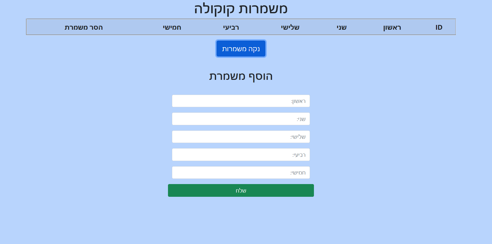
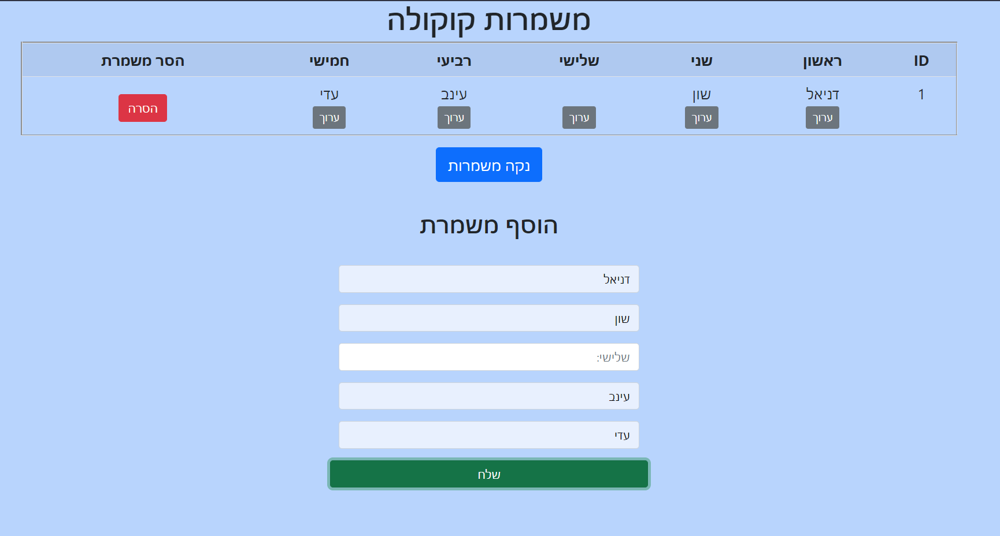
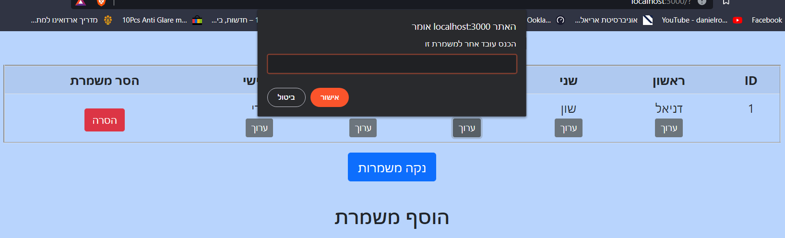
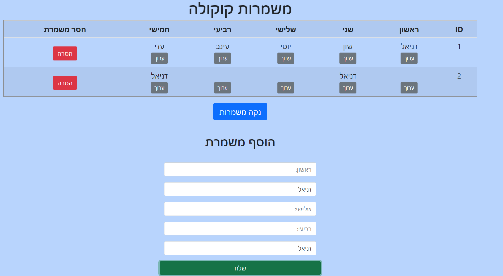

# Shifts Management App (Node.js)

## 📌 Overview
This project is a backend application built using **Node.js**.  
It provides a system for managing employee shifts, including creating, updating, and retrieving shift data.

The project demonstrates server-side development, API design, and handling application logic using JavaScript.

---

## 🚀 Features
- Manage employee shifts
- Create new shifts
- Update existing shifts
- Retrieve shift data
- RESTful API structure
- Organized backend logic

---

## 🛠 Technologies
- Node.js
- JavaScript
- Express.js (if used)
- JSON / File system / Database

---

## 📁 Project Structure
- `server.js` – main server file  
- `models/` – data structure  
- `public/` – frontend files (HTML, JS)  
- `img/` – screenshots  

---

## ▶️ How to Run

1. Install dependencies:
```
npm install
```

2. Start the server:
```
node server.js
```

Or (if using nodemon):
```
nodemon server.js
```

---

## 📬 Example API Endpoints

| Method | Endpoint        | Description      |
|--------|----------------|------------------|
| GET    | /shifts        | Get all shifts   |
| POST   | /shifts        | Create shift     |
| PUT    | /shifts/:id    | Update shift     |
| DELETE | /shifts/:id    | Delete shift     |

---

## 📸 Screenshots

### Home Page


### Shifts List


### Create Shift


### Edit Shift


---

## 🎯 Purpose
This project was developed as part of a **Full Stack Node.js course**  
to practice backend development and API design.

---

## 👨‍💻 Author
Mohamad Mousa  
GitHub: https://github.com/14mohamad